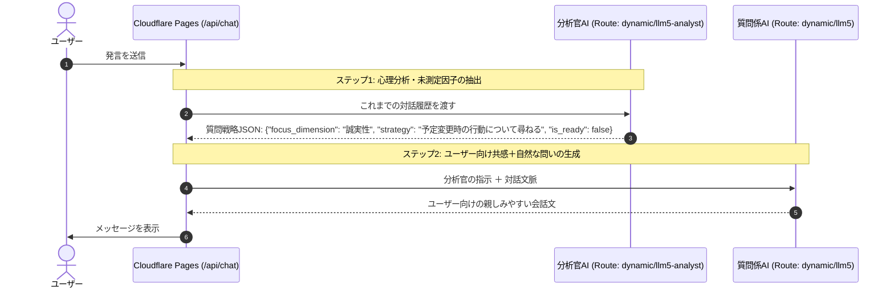

# LLM5

Cloudflare Pages × **Cloudflare AI Gateway (Routes: dynamic/llm5-analyst & dynamic/llm5)** で動作する、**デュアルLLM・完全対話集中・白基調スマートフォン特化型**の性格分析Webアプリケーションです。

---

## 🧠 デュアルLLMアーキテクチャ

1つのAIにすべてをやらせるのではなく、**2つのAIがリアルタイムに連携**することで、最高精度の心理分析と心地よい自然な対話を両立しています。



1. **裏方の分析官AI (Cloudflare `Clef-flash` / Route: `dynamic/llm5-analyst`)**:
   - 会話履歴からビッグファイブの5因子（開放性、誠実性、外向性、協調性、情緒安定性）の測定状況を冷徹に追跡。
   - Cloudflare最新の超高速意思決定モデル **`@cf/cloudflare/clef-flash`**（中央値 ~38.8ms）を優先使用し、「どの因子が情報不足か」「次にどんなシチュエーションを尋ねるべきか」を瞬時に意思決定（未設定時は `dynamic/llm5-analyst` へ自動フォールバック）。
   - ※ 使用するAIモデルはCloudflare AI Gateway / Workers AI側で柔軟に切り替え・管理可能。
2. **表舞台の質問係AI (`dynamic/llm5`)**:
   - 分析官からの戦略指示を受け取り、会話の流れに寄り添いながら、日常の自然な言葉に変換してユーザーに語りかける。
3. **最終プロファイラー (`dynamic/llm5`)**:
   - 会話終了後、詳細な5因子スコア（0〜100）、レーダーチャート用データ、キャッチコピー、強み・適職・対人関係のアドバイスを構造化生成。

---

## 📊 心理測定尺度（質問紙アンケート）による客観的照合

AIの対話推定スコアと、心理学で確立された質問紙（自己評価尺度）の回答スコアを比較・検証できます。診断完了後、以下の3つの尺度から任意に選択して回答できます。

1. **TIPI-J (日本語版Ten Item Personality Inventory)**: 小塩ら (2012)
   - 10項目 / 7件法（所要時間: 約1〜2分）
2. **Big Five 尺度短縮版 (並川ら)**: 並川ら (2012)
   - 29項目 / 7件法（所要時間: 約3〜5分）
3. **BFI-2-S 日本語版 (Big Five Inventory-2 短縮版)**: 吉野ら (2026) / Soto & John (2017)
   - 30項目 / 5件法（所要時間: 約3〜5分）

回答後、**AI推定スコア vs 質問紙測定スコアの比較レーダーチャートおよび差異一覧表**が即座に生成されます。

---

## 💾 データ永続化 (Cloudflare D1 & R2)

学術研究・照合分析のために、以下のデータが Cloudflare D1（および R2 バケット）に自動保存されます。

- **被験者プロファイル**: 学籍番号 (`student_id`)、年齢 (`age`)、性別 (`gender`)
- **AI対話ログ**: 全会話履歴（ユーザー発話、AI発話の全トランスクリプト）
- **AI分析結果**: 5因子推定スコア (0〜100)、性格タイプ、深層プロファイリング根拠
- **質問紙回答データ**: 選択した尺度、各設問の生回答、尺度得点 (0〜100正規化)

### D1 データベース & R2 バケット設定

本プロジェクトでは以下のCloudflareストレージが `wrangler.toml` に設定済みです：
- **D1 データベース**: `llm5-db-d1` (`9cdaa476-7091-4e37-b67f-f3c2af7cfb55`)
- **R2 バケット**: `llm-db-r2`

※ `/api/save` 呼び出し時にテーブル（`assessment_sessions`）が存在しない場合は**自動でテーブル作成（Auto-Migration）が実行される**ため、手動でのスキーマ適用は不要ですが、手動実行する場合は以下で行えます：

```bash
# スキーマの手動適用（任意）
npx wrangler d1 execute llm5-db-d1 --remote --file=./schema.sql
```

### 📥 研究データのエクスポート

- **JSON形式**: `GET https://<Pagesドメイン>/api/export`
- **CSV形式**: `GET https://<Pagesドメイン>/api/export?format=csv`

---

## 📱 UI/UX 特徴

- **診断前プロファイル登録**: 初回アクセス時に学籍番号・年齢・性別をスムーズに入力（ローカル保存対応・後から編集可能）。
- **完全対話集中の没入UI**: ヘッダーやアバター等の余計な装飾を排した白基調ミニマルデザイン。
- **安心のプロバイダーキー非保持**: Gemini等のプロバイダーAPIキーはAI Gateway側で安全に自動注入。

---

## ☁️ Cloudflare Pages での設定

Cloudflare Pages の **Settings > Environment variables** にて以下を設定（デフォルトで自動設定されているため、基本は自動で動作します）:

| 変数名 (Variable name) | デフォルト / 例 | 説明 |
| :--- | :--- | :--- |
| **`CF_ACCOUNT_ID`** | `e809b1129ec4b6f69520858ac79b2095` | Cloudflare アカウントID |
| **`CF_GATEWAY_ID`** | `llm5` | AI Gatewayの名称（slug）。ダッシュボードで作成した名前を指定 |
| **`CF_AIG_TOKEN`** | `（あなたのToken）` | 【任意】AI Gatewayで認証トークンを有効化している場合のみ設定 |
| **`CF_AI_GATEWAY_URL`** | `https://gateway.ai.cloudflare.com/v1/.../compat/chat/completions` | 【任意】エンドポイントURL全体を手動指定したい場合 |

### 🔍 疎通確認用エンドポイント
デプロイ後、`https://<あなたのPagesドメイン>/api/health` にアクセスすると、AI Gatewayへの接続先URLや設定状況をJSONで即座に確認できます。

