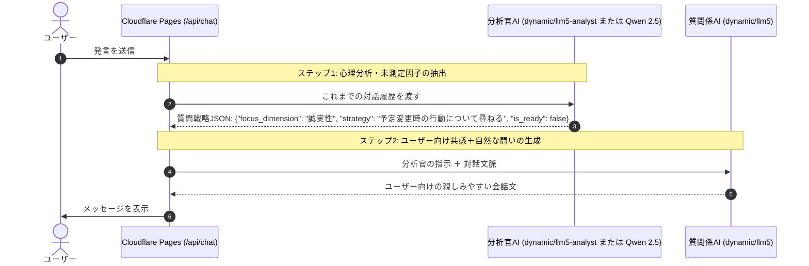

# OCEAN AI - ビッグファイブ対話型性格分析ツール (LLM5)

Cloudflare Pages × **Cloudflare AI Gateway (Routes: dynamic/llm5-analyst & dynamic/llm5)** で動作する、**デュアルLLM・完全対話集中・白基調スマートフォン特化型**のビッグファイブ（OCEAN）性格分析Webアプリケーションです。

---

## 🧠 デュアルLLMアーキテクチャ

1つのAIにすべてをやらせるのではなく、**2つのAIがリアルタイムに連携**することで、最高精度の心理分析と心地よい自然な対話を両立しています。

1. **裏方の分析官AI (`dynamic/llm5-analyst` または Workers AI Qwen 2.5)**:
   - 会話履歴からビッグファイブの5因子（開放性、誠実性、外向性、協調性、情緒安定性）の測定状況を冷徹に追跡。
   - 「どの因子が情報不足か」「次にどんなシチュエーションを尋ねるべきか」の戦略JSONを高速生成。
2. **表舞台の質問係AI (`dynamic/llm5`)**:
   - 分析官からの戦略指示を受け取り、会話の流れに寄り添いながら、日常の自然な言葉に変換してユーザーに語りかける。
3. **最終プロファイラー (`dynamic/llm5`)**:
   - 会話終了後、詳細な5因子スコア（0〜100）、レーダーチャート用データ、キャッチコピー、強み・適職・対人関係のアドバイスを構造化生成。

---

## 📱 UI/UX 特徴

- **完全対話集中の没入UI**:
  - ヘッダーやアバター、進度バッジ等の余計な装飾を一切排除。
  - スマホ全画面（`100dvh`）に対話チャットのみが広がるミニマルな白基調デザイン。
- **安心のプロバイダーキー非保持**:
  - Gemini等のプロバイダーAPIキーはアプリ環境変数に一切不要。AI Gateway側で安全に自動注入。

---

## ☁️ Cloudflare Pages での設定

Cloudflare Pages の **Settings > Environment variables** にて以下を設定（デフォルトで自動解決されるため、基本はデフォルトで動作します）:

| 変数名 (Variable name) | 推奨値 / 例 | 説明 |
| :--- | :--- | :--- |
| **`CF_ACCOUNT_ID`** | `e809b1129ec4b6f69520858ac79b2095` | アカウントID（未指定時もコード内でデフォルト設定済） |
| **`CF_AIG_TOKEN`** | `あなたのGatewayトークン` | 【任意】AI Gatewayでトークン認証を設定している場合のみ |
| **`CF_AI_GATEWAY_ANALYST_URL`** | `https://gateway.ai.cloudflare.com/v1/e809b1129ec4b6f69520858ac79b2095/dynamic/llm5-analyst` | 【任意】分析官用RouteのカスタムURL |
| **`CF_AI_GATEWAY_CHAT_URL`** | `https://gateway.ai.cloudflare.com/v1/e809b1129ec4b6f69520858ac79b2095/dynamic/llm5` | 【任意】対話・レポート用RouteのカスタムURL |
