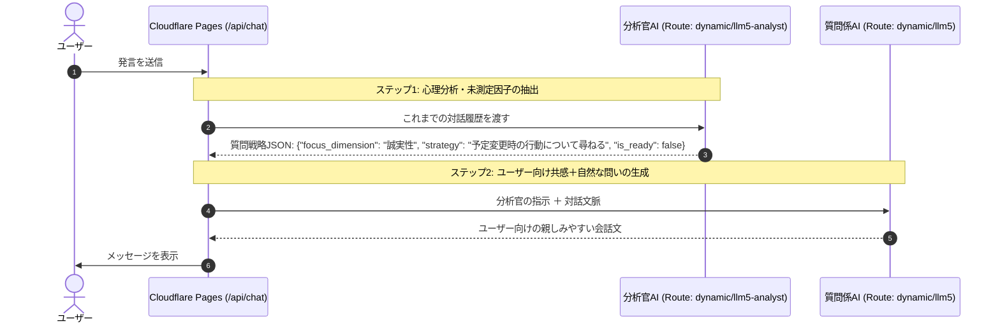

# LLM5

Cloudflare Pages × **Cloudflare AI Gateway (Routes: dynamic/llm5-analyst & dynamic/llm5)** で動作する、**デュアルLLM・完全対話集中・白基調スマートフォン特化型**の性格分析Webアプリケーションです。

---

## 🧠 デュアルLLMアーキテクチャ

1つのAIにすべてをやらせるのではなく、**2つのAIがリアルタイムに連携**することで、最高精度の心理分析と心地よい自然な対話を両立しています。



1. **裏方の分析官AI (Workers AI `@cf/cloudflare/clef-flash` / Route: `dynamic/llm5-analyst`)**:
   - 会話履歴からビッグファイブの5因子（開放性、誠実性、外向性、協調性、情緒安定性）の測定状況を冷徹に追跡。
   - Cloudflareの高速意思決定モデル `Clef-flash` により、「十分なエピソードが集まったか（yes/no判定）」「どの因子が情報不足か」「次にどんなシチュエーションを尋ねるべきか」をミリ秒単位で判定。
   - `wrangler.toml` の `[ai]` バインディング（`env.AI.run`）により、**APIトークン不要で内部認証・AI Gateway自動ログ連携**を実現。HTTP外部経由時はトークン認証やルールベース判定への二重フォールバックを備えています。
2. **表舞台の質問係AI (`dynamic/llm5`)**:
   - 分析官からの戦略指示を受け取り、会話の流れに寄り添いながら、日常の自然な言葉に変換してユーザーに語りかける。
3. **最終プロファイラー (`dynamic/llm5`)**:
   - 会話終了後、詳細な5因子スコア（0〜100）、レーダーチャート用データ、キャッチコピー、強み・適職・対人関係のアドバイスを構造化生成。

---

## 📊 質問紙（Qualtrics）連携 & 分析結果照合・永続化フロー

AI対話終了後、外部アンケートプラットフォーム（Qualtrics）の心理尺度質問紙へスムーズに遷移して回答し、その結果をAI分析結果とリアルタイムに比較・永続化できます。

### ⚡ 質問紙回答中のAI分析並行実行
1. **チャット対話終了**:
   - ユーザーが「質問紙へ進む」を押した瞬間に、対話ログがサーバー（`/api/analyze-async`）に送信されます。
   - Cloudflare Workers の `context.waitUntil` を活用し、**ユーザーを待たせることなく即座にQualtricsへ自動遷移**します。
2. **回答中のバックグラウンド分析**:
   - ユーザーがQualtricsでアンケートに回答している間に、サーバー側でAI分析官による深層プロファイリングが非同期に実行され、D1データベースおよびR2に結果が保存されます。
3. **Qualtrics回答後のシームレスなレポート表示 & 自動照合**:
   - 回答完了後、当アプリケーションへ自動リダイレクト（例: `?phase=result&session_id=...&qualtrics_id=R_xxxx&o=75&c=80&e=60&a=85&n=40`）されます。
   - アプリケーションがQualtricsのスコアを自動抽出し、**Cloudflare D1およびR2へ即座に保存・更新**します。
   - 結果画面にて「AI対話推定スコア」と「クアルトリクス分析結果」の**二重レーダーチャート・差異テーブル・総合一致度（MAE）・照合考察インサイト**が表示され、精密な比較検討が可能です。

### 🔗 Qualtrics分析結果の連携方法
1. **リダイレクトURLのクエリパラメータ連携（推奨）**:
   Qualtricsアンケートの終了要素のリダイレクトURLに以下のパラメータを設定することで、自動的にスコアが受け渡され保存されます：
   - `session_id`: `${e://Field/session_id}`
   - `qualtrics_id`: `${e://Field/ResponseID}`
   - 各因子スコア: `o`, `c`, `e`, `a`, `n` （または `openness`, `conscientiousness`, `extraversion`, `agreeableness`, `neuroticism`）※1〜7点平均でも0〜100点スケールでも自動正規化対応
2. **Qualtrics Webhook / Webサービス連携 (`/api/qualtrics`)**:
   QualtricsのActionsタスクから当アプリの `/api/qualtrics` エンドポイントへJSON POSTすることで、回答完了と同時にD1およびR2へ直接保存可能です。
3. **結果画面での手動入力・照合機能**:
   結果画面の「クアルトリクス結果を入力して比較」ボタンから、5因子スコアおよびQualtrics IDを手動入力でき、即座にD1・R2へ保存され比較チャートが更新されます。

---

## 💾 データ永続化 (Cloudflare D1 & R2)

学術研究・照合分析のために、以下のデータが Cloudflare D1（および R2 バケット）に自動保存されます。

- **被験者プロファイル**: 学籍番号 (`student_id`)、年齢 (`age`)、性別 (`gender`)
- **AI対話ログ**: 全会話履歴（ユーザー発話、AI発話の全トランスクリプト）
- **AI分析結果**: 5因子推定スコア (0〜100)、性格タイプ、深層プロファイリング根拠
- **質問紙回答データ**: 選択した尺度、各設問の生回答、尺度得点 (0〜100正規化)

### D1 データベース & R2 バケット設定

本プロジェクトでは以下のCloudflareストレージが `wrangler.toml` に設定済みです：
- **D1 データベース**: `llm5-db-d1` (`9cdaa476-7091-4e37-b67f-f3c2af7cfb55`)
- **R2 バケット**: `llm-db-r2`

※ `/api/save` 呼び出し時にテーブル（`assessment_sessions`）が存在しない場合は**自動でテーブル作成（Auto-Migration）が実行される**ため、手動でのスキーマ適用は不要ですが、手動実行する場合は以下で行えます：

```bash
# スキーマの手動適用（任意）
npx wrangler d1 execute llm5-db-d1 --remote --file=./schema.sql
```

### 🔐 研究データ管理画面 (Admin Dashboard)

D1のCLI操作やCloudflareダッシュボードに頼ることなく、Webブラウザ上から視覚的に研究データの閲覧・管理・ダウンロードができる**管理画面（`/admin`）**を用意しています。

- **アクセスURL**: `https://<Pagesドメイン>/admin` （または `?admin`、トップページ下部の「研究データ管理」リンク）
- **アクセス制御**: URLを知っており、パスワード認証を通過した管理者のみ閲覧可能
- **デフォルトパスワード**: `llm5admin`
  - 環境変数 `ADMIN_PASSWORD`（`wrangler.toml` または Cloudflare Pages の環境変数）で自由に変更可能です。

#### 🛠️ 管理画面の主な機能
1. **研究データ統計・KPI**: 総被験者数、AI性格分析完了率、Qualtrics質問紙完了率、平均対話ターン数の自動算出
2. **被験者セッション一覧**: 学籍番号、年齢、性別、実施日時、AIビッグファイブ5因子スコア、質問紙スコア、Qualtrics IDの一覧表示
3. **対話ログ全文ビューア**: AIカウンセラー（Dr. OCEAN）と被験者の全チャット履歴をタイムラインで閲覧可能
4. **設問別生回答の確認**: 質問紙の設問ごとのLikert回答値（1〜7点等）を一覧表示
5. **📥 CSV一括ダウンロード (研究用 UTF-8 BOM付)**:
   - ボタン1クリックで全セッションデータをCSV形式で出力。
   - **UTF-8 BOM** を付加しているため、Excel、SPSS、R、Python等で文字化けすることなく即座に統計・分析が可能です。
6. **📥 JSON一括ダウンロード**: 対話ログ全文やAI詳細分析、設問ごとの回答を含む構造化フルデータセットをダウンロード。
7. **個別セッションJSONダウンロード & セッション削除機能**

---

## 📱 UI/UX 特徴

- **診断前プロファイル登録**: 初回アクセス時に学籍番号・年齢・性別をスムーズに入力（ローカル保存対応・後から編集可能）。
- **完全対話集中の没入UI**: ヘッダーやアバター等の余計な装飾を排した白基調ミニマルデザイン。
- **安心のプロバイダーキー非保持**: Gemini等のプロバイダーAPIキーはAI Gateway側で安全に自動注入。

---

## ☁️ Cloudflare Pages での設定

Cloudflare Pages の **Settings > Environment variables** にて以下を設定（デフォルトで自動設定されているため、基本は自動で動作します）:

| 変数名 (Variable name) | デフォルト / 例 | 説明 |
| :--- | :--- | :--- |
| **`CF_ACCOUNT_ID`** | `e809b1129ec4b6f69520858ac79b2095` | Cloudflare アカウントID |
| **`CF_GATEWAY_ID`** | `llm5` | AI Gatewayの名称（slug）。ダッシュボードで作成した名前を指定 |
| **`CF_AIG_TOKEN`** | `（あなたのToken）` | 【任意】AI Gatewayで認証トークンを有効化している場合のみ設定 |
| **`CF_AI_GATEWAY_URL`** | `https://gateway.ai.cloudflare.com/v1/.../compat/chat/completions` | 【任意】エンドポイントURL全体を手動指定したい場合 |

### 🔍 疎通確認用エンドポイント
デプロイ後、`https://<あなたのPagesドメイン>/api/health` にアクセスすると、AI Gatewayへの接続先URLや設定状況をJSONで即座に確認できます。

